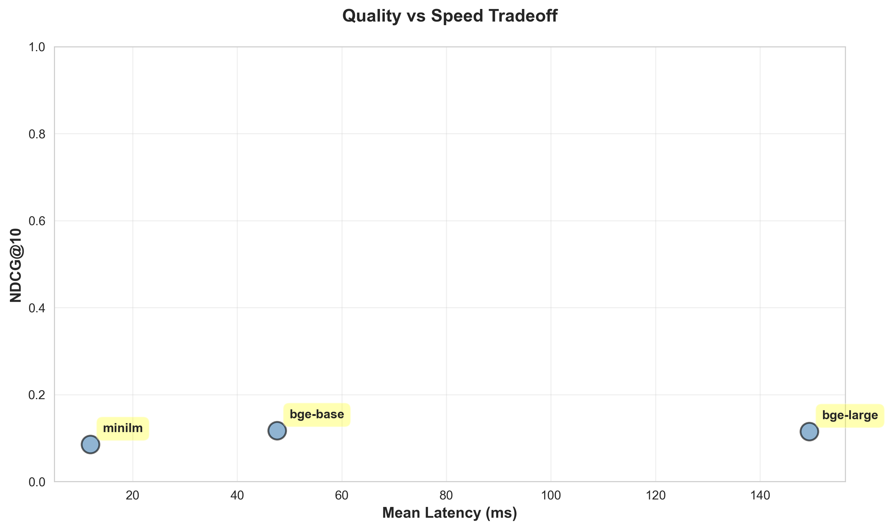
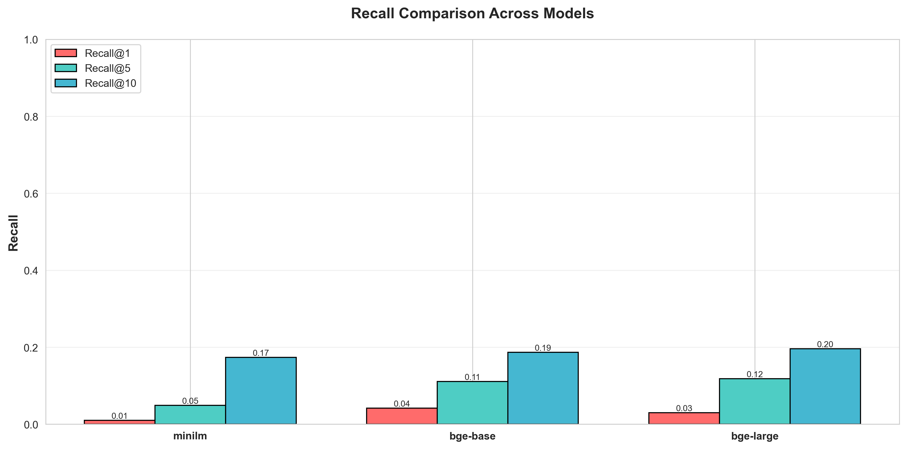
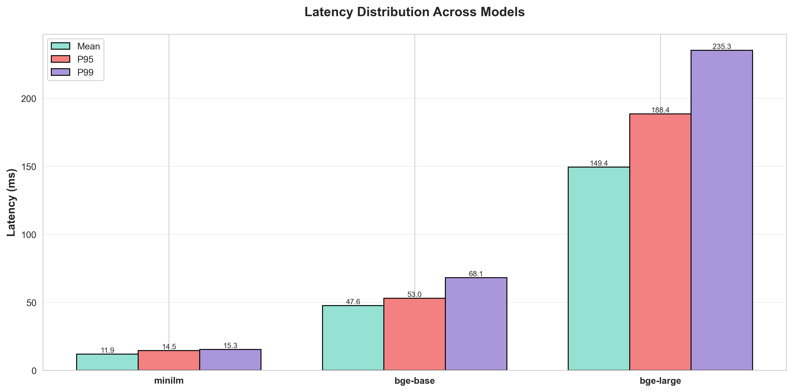
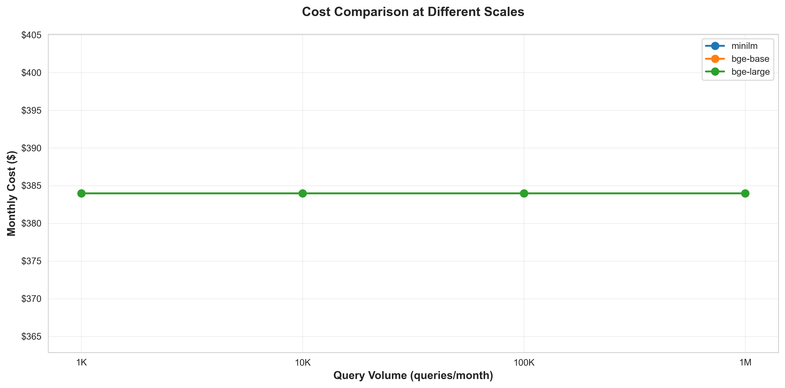
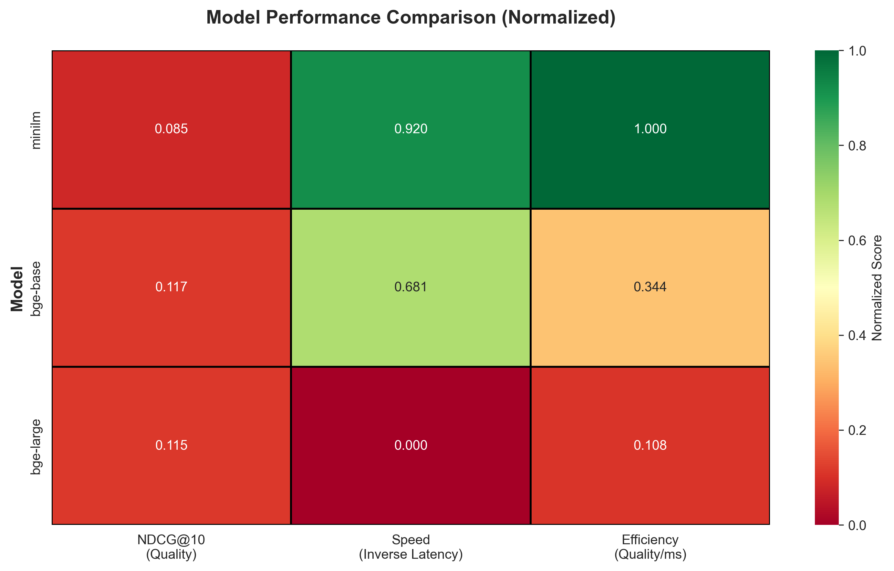

# Text Embeddings Benchmark Results

**Author:** chandu  

**Date:** 2026-01-02  

**Models Tested:** 3  


---

## TL;DR

- **Fastest Model:** minilm with 11.89ms mean latency
- **Best Quality:** bge-base with NDCG@10 of 0.117
- **Best Value (Quality/Speed):** minilm with score of 0.0072
- **Most Cost-Effective:** bge-base for quality per dollar at 100K queries/month
- **Key Insight:** All models are local (no per-token costs), making them economical for high-volume deployments


## Retrieval Quality Results

| Model | Recall@1 | Recall@5 | Recall@10 | NDCG@10 |
|-------|----------|----------|-----------|----------|
| bge-base | 0.042 | 0.111 | 0.187 | 0.117 |
| bge-large | 0.030 | 0.118 | 0.196 | 0.115 |
| minilm | 0.010 | 0.049 | 0.173 | 0.085 |


## Latency Results

| Model | Mean (ms) | Median (ms) | P95 (ms) | P99 (ms) | Std (ms) |
|-------|-----------|-------------|----------|----------|----------|
| bge-base | 47.60 | 46.83 | 52.98 | 68.13 | 5.60 |
| bge-large | 149.42 | 143.11 | 188.40 | 235.25 | 20.53 |
| minilm | 11.89 | 12.09 | 14.54 | 15.33 | 1.80 |


## Cost Analysis

| Model | Type | Monthly Infra | Cost/1K queries | Cost/100K queries | Cost/1M queries |
|-------|------|---------------|-----------------|-------------------|-----------------|
| bge-base | local | $383.98 | $0.3840 | $383.98 | $383.98 |
| bge-large | local | $383.98 | $0.3840 | $383.98 | $383.98 |
| minilm | local | $383.98 | $0.3840 | $383.98 | $383.98 |

**Note:** All models are local, so costs are based on infrastructure only (AWS g4dn.xlarge GPU instance). Costs scale with query volume - if capacity is exceeded, multiple instances are needed.


## Decision Matrix

*When to choose each model:*

### bge-base

**Choose if:**
- You prioritize highest retrieval quality (NDCG@10: 0.117)
- You can accept moderate latency (47.6ms) for better quality
- You prefer local deployment for data privacy
- Your query volume is 54,451,494+ queries/month

**Avoid if:**
- Minimizing latency is top priority (faster options available)
- You lack GPU infrastructure (requires GPU for optimal performance)

---

### bge-large

**Choose if:**
- You prefer local deployment for data privacy
- Your query volume is 17,346,695+ queries/month

**Avoid if:**
- Retrieval quality is critical (NDCG@10 0.115 vs best 0.117)
- Minimizing latency is top priority (faster options available)
- You lack GPU infrastructure (requires GPU for optimal performance)

---

### minilm

**Choose if:**
- You need the fastest inference speed (11.89ms mean latency)
- You need sub-20ms response times for real-time applications
- You prefer local deployment for data privacy
- Your query volume is 217,936,859+ queries/month

**Avoid if:**
- Retrieval quality is critical (NDCG@10 0.085 vs best 0.117)
- You lack GPU infrastructure (requires GPU for optimal performance)

---


## Visualizations

### Quality vs Speed Tradeoff



### Recall Metrics Comparison



### Latency Distribution



### Cost at Different Scales



### Normalized Performance Comparison




## Reproduction Instructions

### Prerequisites

- Python 3.9 or higher
- CUDA-capable GPU (optional but recommended for faster processing)
- 8GB+ RAM
- ~2GB disk space for models

### Setup

1. **Clone or download this repository**

2. **Install dependencies:**
```bash
pip install -r requirements.txt
```

3. **Run the benchmark:**
```bash
python run_benchmarks.py
```

### Expected Runtime

- **First run:** 30-45 minutes (includes model downloads)
  - Model downloads: ~10-15 min (500MB total)
  - Dataset generation: ~1-2 min
  - Benchmarks: ~15-25 min
  - Visualization: ~1 min

- **Subsequent runs:** 15-20 minutes (models cached)

### Output Files

- `results/article.md` - This benchmark report
- `results/raw_results.json` - Complete data in JSON format
- `results/visualizations/` - All generated charts (PNG)

### Customization

Edit `benchmark_config.yaml` to:
- Change dataset size (num_documents, num_queries)
- Adjust latency measurement runs
- Modify cost assumptions
- Add/remove models


## Benchmark Metadata

- **Timestamp:** 2026-01-02T13:31:15.537481
- **Models Tested:** 3
- **Dataset Size:** 500 documents
- **Number of Queries:** 100
- **Latency Measurement Runs:** 100


## Raw Data

Complete benchmark data is available in JSON format:

- **File:** `raw_results.json`
- **Location:** Same directory as this report
- **Format:** Structured JSON with all metrics and metadata

You can use this data for custom analysis or visualization.

